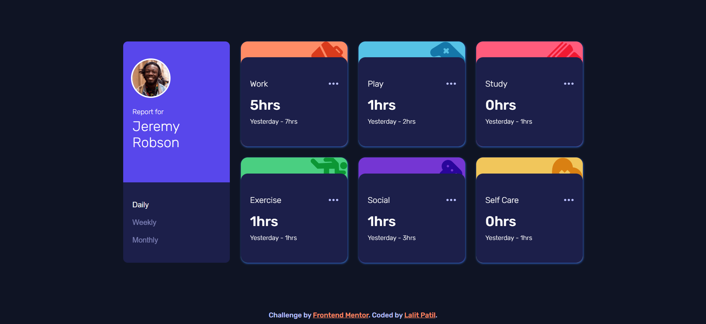
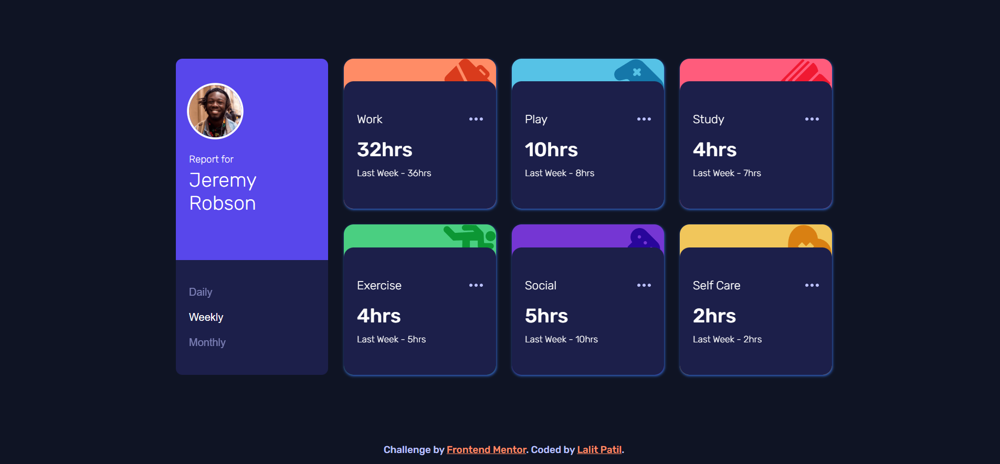
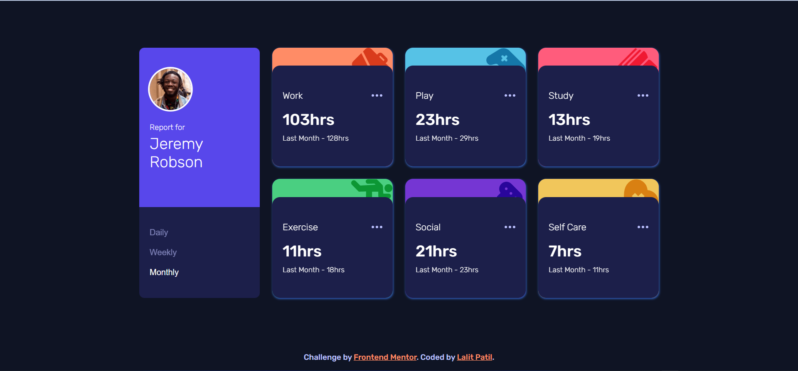

# Frontend Mentor - Time tracking dashboard solution

This is a solution to the [Time tracking dashboard challenge on Frontend Mentor](https://www.frontendmentor.io/challenges/time-tracking-dashboard-UIQ7167Jw). Frontend Mentor challenges help you improve your coding skills by building realistic projects. 

## Table of contents

- [Overview](#overview)
  - [The challenge](#the-challenge)
  - [Screenshot](#screenshot)
  - [Links](#links)
- [My process](#my-process)
  - [Built with](#built-with)
  - [What I learned](#what-i-learned)
  - [Useful resources](#useful-resources)
- [Author](#author)


## Overview

### The challenge

Users should be able to:

- View the optimal layout for the site depending on their device's screen size
- Switch between viewing Daily, Weekly, and Monthly stats

### Screenshot





### Links

- Solution URL: [GitHub](https://github.com/LalitPatil1634/time-tracking-dashboard-project)
- Live Site URL: [Netlify](https://splendid-cajeta-79631d.netlify.app)

## My process

### Built with

- Semantic HTML5 markup
- CSS custom properties
- Flexbox
- CSS Grid
- Media Queries
- Fetch API
- Mobile-first workflow
- [Styled Components](https://styled-components.com/) - For styles

### What I learned

```html
<h1>Some HTML code I'm proud of</h1>
```
```css
@media screen and (min-width: 650px) {
  .activity {
    display: grid;
    grid-template-columns: 1fr 1fr;
    gap: 1.5rem;
  }
}
```
```js
const fetchData = async () => {
  const response = await fetch('data.json');
  const newRes = await response.json();
  handleUserActivity(newRes);
};
window.addEventListener('DOMContentLoaded', () => {
  fetchData();
});
```

### Useful resources

- [JavaScript](https://www.example.com) - This helped me for Fetch API. I really liked this pattern and will use it going forward.
- [CSS](https://www.w3schools.com/w3css/) - This is an amazing article which helped me finally understand CSS Deep concepts. I'd recommend it to anyone still learning this concept.

## Author

- Frontend Mentor - [@LalitPatil1634](https://www.frontendmentor.io/profile/LalitPatil1634)
- Twitter - [@lalit_lp98](https://twitter.com/lalit_lp98)
